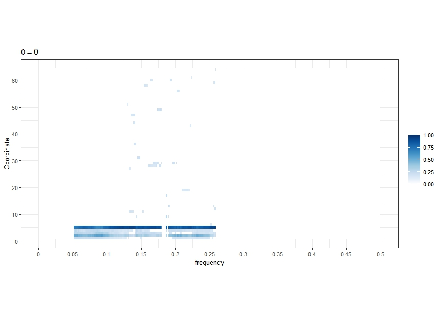
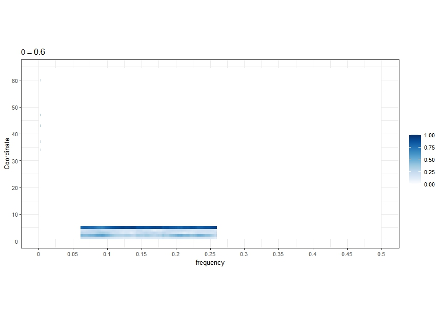
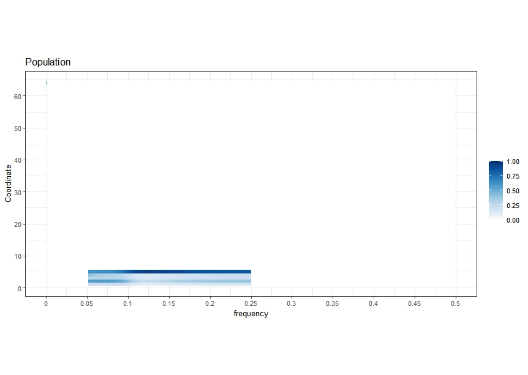
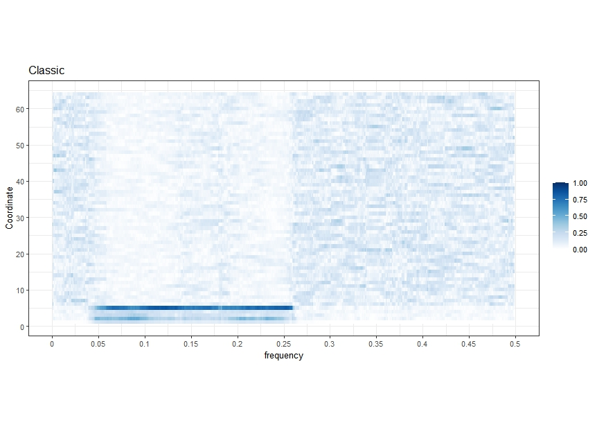

# LSPCA

`LSPCA` is an R-package that provides an implementation of the localized and sparse principal components of multivariate time series in the frequency domain. The algorithm is based on the paper
[Localized Sparse Principal Component Analysis in Frequency Domain](https://arxiv.org/abs/2408.08177#)
by Jamshid Namdari, Amita Manatunga,Fabio Ferrarelli, and Robert Krafty.

## Installation

Currently the `LSPCA` has not been submitted to CRAN, but it can be installed dirrectly from GitHub:

```r
library(devtools)
install_github("jamnamdari/LSPCA")
```


The `LSPCA()` function requires the user to install and call the following libraries

+ library(astsa)
+ library(waveslim)
+ library(ggplot2)
+ library(RSpectra)
+ library(lpSolve)
+ library(gradfps)

Note that `gradfps` is not available on CRAN and can be installed from their authors` guithub page.

```r
library(devtools)
install_github("yixuan/gradfps")
```
The other libraries are aveilabe on CRAN and can be installed by calling `install.packages("name_of_the_package")`.

Note that `gradfps` would need a C++ compiler that supports the C++11 standard.
The authors of `gradfps` have suggested that "For best performance, it is strongly suggested linking your R to the
[OpenBLAS](https://www.openblas.net/) library for matrix computation.
You can achieve this with the help of the
[ropenblas](https://prdm0.github.io/ropenblas/) package".

We suggest to call the following libraries before running the examples.

```r
library(gradfps)
library(RSpectra)
library(mvtnorm)
library(Matrix)
library(ggplot2)
library(astsa)
library(lpSolve)
library(lattice)
library(astsa)
library(waveslim)
library(LSPCA)
library(dplR)

```

### Example

The R-code provided below reproduces Figure 2 of the main manuscript.

The dataframe `D` included in the R package `LSPCA` contains a realization of the 64 dimensional time series at times t = 1, ..., 1024. Detailed instruction on how to generate the samples are privided in the <a href="./Help_files/Data_Generation.md">data generation file</a>.

First we estimate the spectral density matrix.

```r
## Multitaper Estimate
U <- sine.taper(n,20)
X_tp <- apply(U, MARGIN = 2, function(u) u*D, simplify = FALSE)
F_tp_list <- lapply(X_tp, FUN = function(Y) mvspec(Y,plot = FALSE) )

len_freq <- n/2
F_tp1 <- array(0, c(p, p, len_freq))
for (ell in 1:len_freq) {
  for(j in 1:length(F_tp_list)){
    F_tp1[,,ell] <- F_tp1[,,ell] + F_tp_list[[j]]$fxx[,,ell]
  }
  F_tp1[,,ell] <- F_tp1[,,ell]/length(F_tp_list)
}
f_xx1 <- F_tp1*n
rm(U)
rm(X_tp)
rm(F_tp_list)
gc()

## Plot of the estimated spectral density
plot(omega, f_xx1[1,1,1:512], type="l", ylim = c(0,30), ylab="", xlab="Frequency")
for (k in 2:64) {
  points(omega, f_xx1[k,k,1:512], type="l", col=k)
}
abline(v=c(0.05,0.25))

```


Next we estimate the leading principal subspace of the underlying spectral density matrices over the frequency range [0,32] Hz.

```r
##################################################
## Estimate of 1-dimensional principal subspaces
##################################################

## Without smoothing
LSDPCA_ADMM_SOAP_Ex1 <- LSPCA(n,p, f_xx1, lambda = 0.5 * sqrt(log(p) / n), d=1, lr = 0.02, maxiter = 60,
                                                 control = list(fan_maxinc = 10, verbose = 0), eta=200, s=5, n_iter = 20, nu=0)


## With smoothing
LSDPCA_ADMM_SOAP_Ex2 <- LSPCA(n,p, f_xx1, lambda = 0.5 * sqrt(log(p) / n), d=1, lr = 0.02, maxiter = 60,
                                                 control = list(fan_maxinc = 10, verbose = 0), eta=200, s=5, n_iter = 20, nu=0.6)


```

## Plots

### Bottom Left panel of Figure 2

Bottom Left panel of Figure 2 of the main manuscript can be reproduced by the follwoing code.

```r
###########################
## Plots
###########################

library(latex2exp)


xlab <- "Hz"
ylab <- "Coordinate"
legend_title = ""
asp = .5 #0.2
bar_height = 10/2
font_size = 20/2


Localized_Est <- selector(LSDPCA_ADMM_SOAP_Ex1[[1]],f_xx1,n/2,(2/5)*512,p)
evecs <- t(Mod(Localized_Est[[1]]))
v = as.matrix(evecs)
lo = min(v)
hi = max(v)
#lo <- 0
#hi <- .9
r = max(abs(c(lo, hi)))
gdat = data.frame(x = as.integer(row(v)), y = as.integer(col(v)),
                  z = as.numeric(v))
ngrid = 1001
pal = c("#67000d", "#a50f15", "#cb181d", "#ef3b2c", "#fb6a4a",
        "#fc9272", "#fcbba1", "#fee0d2", "#ffffff", "#deebf7",
        "#c6dbef", "#9ecae1", "#6baed6", "#4292c6", "#2171b5",
        "#08519c", "#08306b")
col_pal = colorRampPalette(pal)(ngrid)
col_val = seq(-r, r, length.out = ngrid)
lo_ind = findInterval(lo, col_val)
hi_ind = findInterval(hi, col_val)
colors = col_pal[lo_ind:hi_ind]

ggplot(gdat, aes(x = x, y = y, fill = z)) + geom_tile() +
  scale_x_continuous(xlab, expand = c(0, 0)) + scale_y_reverse(ylab,
                                                               breaks = 1:ncol(v), expand = c(0, 0)) + scale_fill_gradientn(legend_title,
                                                                                                                            colors = colors, limits = c(0, 1)) + guides(fill = guide_colorbar(barheight = bar_height)) +
  theme_bw(base_size = font_size) + theme(aspect.ratio = asp) + labs(title = TeX("$\\theta=0$")) +
  scale_y_continuous(name = "Coordinate", breaks=seq(0,p,10)) +
  scale_x_continuous(name = "Hz", breaks = seq(0,.5,by=.05)*(n), labels=function(x) x*64/n)

```


### Bottom Right panel of Figure 2

Bottom right panel of Figure 2 of the main manuscript can be reproduced by the following code.

```r
###########################
## Plots
###########################

library(latex2exp)


xlab <- "Hz"
ylab <- "Coordinate"
legend_title = ""
asp = .5 #0.2
bar_height = 10/2
font_size = 20/2


Localized_Est <- selector(LSDPCA_ADMM_SOAP_Ex2[[1]],f_xx1,n/2,(2/5)*512,p)
evecs <- t(Mod(Localized_Est[[1]]))
v = as.matrix(evecs)
lo = min(v)
hi = max(v)
#lo <- 0
#hi <- .9
r = max(abs(c(lo, hi)))
gdat = data.frame(x = as.integer(row(v)), y = as.integer(col(v)),
                  z = as.numeric(v))
ngrid = 1001
pal = c("#67000d", "#a50f15", "#cb181d", "#ef3b2c", "#fb6a4a",
        "#fc9272", "#fcbba1", "#fee0d2", "#ffffff", "#deebf7",
        "#c6dbef", "#9ecae1", "#6baed6", "#4292c6", "#2171b5",
        "#08519c", "#08306b")
col_pal = colorRampPalette(pal)(ngrid)
col_val = seq(-r, r, length.out = ngrid)
lo_ind = findInterval(lo, col_val)
hi_ind = findInterval(hi, col_val)
colors = col_pal[lo_ind:hi_ind]

ggplot(gdat, aes(x = x, y = y, fill = z)) + geom_tile() +
  scale_x_continuous(xlab, expand = c(0, 0)) + scale_y_reverse(ylab,
                                                               breaks = 1:ncol(v), expand = c(0, 0)) + scale_fill_gradientn(legend_title,
                                                                                                                            colors = colors, limits = c(0, 1)) + guides(fill = guide_colorbar(barheight = bar_height)) +
  theme_bw(base_size = font_size) + theme(aspect.ratio = asp) + labs(title = TeX("$\\theta=0.6$")) +
  scale_y_continuous(name = "Coordinate", breaks=seq(0,p,10)) +
  scale_x_continuous(name = "Hz", breaks = seq(0,.5,by=.05)*(n), labels=function(x) x*64/n)

```


### Top Left Panel of Figure 2

```r
## Population
Localized_Est <- selector(f_evec11,f_xx1,n/2,(2/5)*512,p)
evecs <- t(Mod(Localized_Est[[1]]))
v = as.matrix(evecs)
lo = min(v)
hi = max(v)
r = max(abs(c(lo, hi)))
gdat = data.frame(x = as.integer(row(v)), y = as.integer(col(v)),
                  z = as.numeric(v))
ngrid = 1001
pal = c("#67000d", "#a50f15", "#cb181d", "#ef3b2c", "#fb6a4a",
        "#fc9272", "#fcbba1", "#fee0d2", "#ffffff", "#deebf7",
        "#c6dbef", "#9ecae1", "#6baed6", "#4292c6", "#2171b5",
        "#08519c", "#08306b")
col_pal = colorRampPalette(pal)(ngrid)
col_val = seq(-r, r, length.out = ngrid)
lo_ind = findInterval(lo, col_val)
hi_ind = findInterval(hi, col_val)
colors = col_pal[lo_ind:hi_ind]

ggplot(gdat, aes(x = x, y = y, fill = z)) + geom_tile() +
  scale_x_continuous(xlab, expand = c(0, 0)) + scale_y_reverse(ylab,
                                                               breaks = 1:ncol(v), expand = c(0, 0)) + scale_fill_gradientn(legend_title,
                                                                                                                            colors = colors, limits = c(0, 1)) + guides(fill = guide_colorbar(barheight = bar_height)) +
  theme_bw(base_size = font_size) + theme(aspect.ratio = asp) + labs(title = TeX("Population")) +
  scale_y_continuous(name = "Coordinate", breaks=seq(0,p,10)) +
  scale_x_continuous(name = "Hz", breaks = seq(0,.5,by=.05)*(n), labels=function(x) x*64/n)

```


### Top Right Panel of Figure 2

```r
## Classic

f_MT_evec11 <- matrix(0, nrow=p, ncol = length(omega))
for(ell in 1:length(omega)){
  f_MT_evec_ell <- eigen(f_xx1[,,ell])$vectors[,1]
  f_MT_evec11[,ell] <- f_MT_evec_ell
  #gc()
}

Localized_Est <- selector(f_MT_evec11,f_xx1,n/2,512,p)
evecs <- t(Mod(Localized_Est[[1]]))
v = as.matrix(evecs)
lo = min(v)
hi = max(v)
r = max(abs(c(lo, hi)))
gdat = data.frame(x = as.integer(row(v)), y = as.integer(col(v)),
                  z = as.numeric(v))
ngrid = 1001
pal = c("#67000d", "#a50f15", "#cb181d", "#ef3b2c", "#fb6a4a",
        "#fc9272", "#fcbba1", "#fee0d2", "#ffffff", "#deebf7",
        "#c6dbef", "#9ecae1", "#6baed6", "#4292c6", "#2171b5",
        "#08519c", "#08306b")
col_pal = colorRampPalette(pal)(ngrid)
col_val = seq(-r, r, length.out = ngrid)
lo_ind = findInterval(lo, col_val)
hi_ind = findInterval(hi, col_val)
colors = col_pal[lo_ind:hi_ind]

ggplot(gdat, aes(x = x, y = y, fill = z)) + geom_tile() +
  scale_x_continuous(xlab, expand = c(0, 0)) + scale_y_reverse(ylab,
                                                               breaks = 1:ncol(v), expand = c(0, 0)) + scale_fill_gradientn(legend_title,
                                                                                                                            colors = colors, limits = c(0, 1)) + guides(fill = guide_colorbar(barheight = bar_height)) +
  theme_bw(base_size = font_size) + theme(aspect.ratio = asp) + labs(title = TeX("Classic")) +
  scale_y_continuous(name = "Coordinate", breaks=seq(0,p,10)) +
  scale_x_continuous(name = "Hz", breaks = seq(0,.5,by=.05)*(n), labels=function(x) x*64/n)


```



# Data Analysis

## HC

You can use the following code to reproduce the top panels of Figure 5 of the main manuscript.

### Read in the Data

We first read in the data and estimate the spectral density matrices.

```r
## Data

X <- HC
p <- ncol(X)
n <- nrow(X)


## Multitaper estimate of the spectral density matrix
U <- sine.taper(n,10)
X_tp <- apply(U, MARGIN = 2, function(u) u*X, simplify = FALSE)
F_tp_list <- lapply(X_tp, FUN = function(Y) mvspec(Y,plot = FALSE) )

len_freq <- n/2
F_tp1 <- array(0, c(p, p, len_freq))
for (ell in 1:len_freq) {
  for(j in 1:length(F_tp_list)){
    F_tp1[,,ell] <- F_tp1[,,ell] + F_tp_list[[j]]$fxx[,,ell]
  }
  F_tp1[,,ell] <- F_tp1[,,ell]/length(F_tp_list)
}
plot(Re(F_tp1[1,1,])*(n), type = "l", ylab = " ", main = "Estimated spectral density", ylim=c(1,2000))
for(a in 2:p){
  lines(Re(F_tp1[a,a,])*n, col= a)
}
f_xx1 <- F_tp1*n
rm(U)
rm(X_tp)
rm(F_tp_list)
#gc()

```

### Principal Subspace Estimation

Next we apply the LSPCA algorithm.

```r
## Localized and sparse PCA
LSDPCA_ADMM_SOAP_Ex2 <- LSPCA(n,p, f_xx1, lambda = 0.5 * sqrt(log(p) / n), d=2, lr = 0.02, maxiter = 60,
                                               control = list(fan_maxinc = 10, verbose = 0), eta=52, s=8, n_iter = 20, nu=0.6)

```

### Plots

#### First PC Loadings

The top left panel of Figure 5 of the main manuscript can be reproduced by the following code.

```r
## Plot

xlab <- "Hz"
ylab <- "Coordinate"
legend_title = ""
asp = .5 #0.2
bar_height = 10/2
font_size = 20/2


Localized_Est <- selector(LSDPCA_ADMM_SOAP_Ex2[[1]],f_xx1,n/2,52,p)
evecs <- t(Mod(Localized_Est[[1]]))
v = as.matrix(evecs)
lo = min(v)
hi = max(v)
r = max(abs(c(lo, hi)))
gdat = data.frame(x = as.integer(row(v)), y = as.integer(col(v)),
                  z = as.numeric(v))
ngrid = 1001
pal = c("#67000d", "#a50f15", "#cb181d", "#ef3b2c", "#fb6a4a",
        "#fc9272", "#fcbba1", "#fee0d2", "#ffffff", "#deebf7",
        "#c6dbef", "#9ecae1", "#6baed6", "#4292c6", "#2171b5",
        "#08519c", "#08306b")
col_pal = colorRampPalette(pal)(ngrid)
col_val = seq(-r, r, length.out = ngrid)
lo_ind = findInterval(lo, col_val)
hi_ind = findInterval(hi, col_val)
colors = col_pal[lo_ind:hi_ind]

ggplot(gdat, aes(x = x, y = y, fill = z)) + geom_tile() +
  scale_x_continuous(xlab, expand = c(0, 0)) + scale_y_reverse(ylab,
                                                               breaks = 1:ncol(v), expand = c(0, 0)) + scale_fill_gradientn(legend_title,
                                                                                                                            colors = colors) + guides(fill = guide_colorbar(barheight = bar_height)) +
  theme_bw(base_size = font_size) + theme(aspect.ratio = asp) + labs(title = "HC - Modulus of the first PC loadings") +
  scale_y_continuous(name = "Coordinate", breaks=seq(0,p,10)) +
  scale_x_continuous(name = "Hz", breaks = seq(0,.5,by=.05)*(n), limits = c(0,320), labels=function(x) x*64/n)+
  #geom_vline(xintercept = 8*2, linetype="dotted", color = "red", size=.25)+
  geom_vline(xintercept = 64*2, linetype="dotted", color = "red", size=.25)+
  geom_vline(xintercept = 112*2, linetype="dotted", color = "red", size=.25)

```


#### Second PC Loadings

The top right panel of Figure 5 of the main manuscript can be reproduced by the following code.

```r
freq_s <- Localized_Est[[2]]
freq_selector <- matrix(rep(freq_s, p), nrow = p, byrow = TRUE)
evec2_Re <- freq_selector*Mod(LSDPCA_ADMM_SOAP_Ex2[[2]])
evecs <- t(evec2_Re)
v = as.matrix(evecs)
lo = min(v)
hi = max(v)
r = max(abs(c(lo, hi)))
gdat = data.frame(x = as.integer(row(v)), y = as.integer(col(v)),
                  z = as.numeric(v))
ngrid = 1001
pal = c("#67000d", "#a50f15", "#cb181d", "#ef3b2c", "#fb6a4a",
        "#fc9272", "#fcbba1", "#fee0d2", "#ffffff", "#deebf7",
        "#c6dbef", "#9ecae1", "#6baed6", "#4292c6", "#2171b5",
        "#08519c", "#08306b")
col_pal = colorRampPalette(pal)(ngrid)
col_val = seq(-r, r, length.out = ngrid)
lo_ind = findInterval(lo, col_val)
hi_ind = findInterval(hi, col_val)
colors = col_pal[lo_ind:hi_ind]

ggplot(gdat, aes(x = x, y = y, fill = z)) + geom_tile() +
  scale_x_continuous(xlab, expand = c(0, 0)) + scale_y_reverse(ylab,
                                                               breaks = 1:ncol(v), expand = c(0, 0)) + scale_fill_gradientn(legend_title,
                                                                                                                            colors = colors) + guides(fill = guide_colorbar(barheight = bar_height)) +
  theme_bw(base_size = font_size) + theme(aspect.ratio = asp) + labs(title = "HC - Modulus of the second PC loadings") +
  scale_y_continuous(name = "Coordinate", breaks=seq(0,p,10)) +
  scale_x_continuous(name = "Hz", breaks = seq(0,.5,by=.05)*(n), limits = c(0,320), labels=function(x) x*64/n)+
  #geom_vline(xintercept = 8*2, linetype="dotted", color = "red", size=.25)+
  geom_vline(xintercept = 64*2, linetype="dotted", color = "red", size=.25)+
  geom_vline(xintercept = 112*2, linetype="dotted", color = "red", size=.25)

```


## FEP

You can use the following code to reproduce the bottom panels of Figure 5 of the main manuscript.

### Read in the Data

You can use the following code to reproduce bottom left panel of Figure 5 of the main manuscript.

We first read in the data and estimate the spectral density matrices.

```r
## Data

X <- FEP
p <- ncol(X)
n <- nrow(X)


## Multitaper estimate of the spectral density matrix
U <- sine.taper(n,10)
X_tp <- apply(U, MARGIN = 2, function(u) u*X, simplify = FALSE)
F_tp_list <- lapply(X_tp, FUN = function(Y) mvspec(Y,plot = FALSE) )

len_freq <- n/2
F_tp1 <- array(0, c(p, p, len_freq))
for (ell in 1:len_freq) {
  for(j in 1:length(F_tp_list)){
    F_tp1[,,ell] <- F_tp1[,,ell] + F_tp_list[[j]]$fxx[,,ell]
  }
  F_tp1[,,ell] <- F_tp1[,,ell]/length(F_tp_list)
}
plot(Re(F_tp1[1,1,])*(n), type = "l", ylab = " ", main = "Estimated spectral density", ylim=c(1,400))
for(a in 2:p){
  lines(Re(F_tp1[a,a,])*n, col= a)
}
f_xx1 <- F_tp1*n
rm(U)
rm(X_tp)
rm(F_tp_list)
#gc()

```

### Principal Subspace Estimation

Next we apply the LSPCA algorithm.

```r
## Localized and sparse PCA
LSDPCA_ADMM_SOAP_Ex2 <- LSPCA(n,p, f_xx1, lambda = 0.5 * sqrt(log(p) / n), d=2, lr = 0.02, maxiter = 60,
                                               control = list(fan_maxinc = 10, verbose = 0), eta=41, s=8, n_iter = 20, nu=0.2)

```

### Plots

Finally, the bottom left panel of Figure 5 of the main manuscript can be reproduced by the following code.

```r
## Plot

xlab <- "Hz"
ylab <- "Coordinate"
legend_title = ""
asp = .5 #0.2
bar_height = 10/2
font_size = 20/2


Localized_Est <- selector(LSDPCA_ADMM_SOAP_Ex2[[1]],f_xx1,n/2,41,p)
evecs <- t(Mod(Localized_Est[[1]]))
v = as.matrix(evecs)
lo = min(v)
hi = max(v)
r = max(abs(c(lo, hi)))
gdat = data.frame(x = as.integer(row(v)), y = as.integer(col(v)),
                  z = as.numeric(v))
ngrid = 1001
pal = c("#67000d", "#a50f15", "#cb181d", "#ef3b2c", "#fb6a4a",
        "#fc9272", "#fcbba1", "#fee0d2", "#ffffff", "#deebf7",
        "#c6dbef", "#9ecae1", "#6baed6", "#4292c6", "#2171b5",
        "#08519c", "#08306b")
col_pal = colorRampPalette(pal)(ngrid)
col_val = seq(-r, r, length.out = ngrid)
lo_ind = findInterval(lo, col_val)
hi_ind = findInterval(hi, col_val)
colors = col_pal[lo_ind:hi_ind]

ggplot(gdat, aes(x = x, y = y, fill = z)) + geom_tile() +
  scale_x_continuous(xlab, expand = c(0, 0)) + scale_y_reverse(ylab,
                                                               breaks = 1:ncol(v), expand = c(0, 0)) + scale_fill_gradientn(legend_title,
                                                                                                                            colors = colors) + guides(fill = guide_colorbar(barheight = bar_height)) +
  theme_bw(base_size = font_size) + theme(aspect.ratio = asp) + labs(title = "FEP - Modulus of the first PC loadings") +
  scale_y_continuous(name = "Coordinate", breaks=seq(0,p,10)) +
  scale_x_continuous(name = "Hz", breaks = seq(0,.5,by=.05)*(n), limits = c(0,320), labels=function(x) x*64/n)+
  #geom_vline(xintercept = 8*2, linetype="dotted", color = "red", size=.25)+
  geom_vline(xintercept = 64*2, linetype="dotted", color = "red", size=.25)+
  geom_vline(xintercept = 112*2, linetype="dotted", color = "red", size=.25)

```


#### Second PC Loadings

The bottom right panel of Figure 5 of the main manuscript can be reproduced by the following code.

```r
freq_s <- Localized_Est[[2]]
freq_selector <- matrix(rep(freq_s, p), nrow = p, byrow = TRUE)
evec2_Re <- freq_selector*Mod(LSDPCA_ADMM_SOAP_Ex2[[2]])
evecs <- t(evec2_Re)
v = as.matrix(evecs)
lo = min(v)
hi = max(v)
r = max(abs(c(lo, hi)))
gdat = data.frame(x = as.integer(row(v)), y = as.integer(col(v)),
                  z = as.numeric(v))
ngrid = 1001
pal = c("#67000d", "#a50f15", "#cb181d", "#ef3b2c", "#fb6a4a",
        "#fc9272", "#fcbba1", "#fee0d2", "#ffffff", "#deebf7",
        "#c6dbef", "#9ecae1", "#6baed6", "#4292c6", "#2171b5",
        "#08519c", "#08306b")
col_pal = colorRampPalette(pal)(ngrid)
col_val = seq(-r, r, length.out = ngrid)
lo_ind = findInterval(lo, col_val)
hi_ind = findInterval(hi, col_val)
colors = col_pal[lo_ind:hi_ind]

ggplot(gdat, aes(x = x, y = y, fill = z)) + geom_tile() +
  scale_x_continuous(xlab, expand = c(0, 0)) + scale_y_reverse(ylab,
                                                               breaks = 1:ncol(v), expand = c(0, 0)) + scale_fill_gradientn(legend_title,
                                                                                                                            colors = colors) + guides(fill = guide_colorbar(barheight = bar_height)) +
  theme_bw(base_size = font_size) + theme(aspect.ratio = asp) + labs(title = "FEP - Modulus of the second PC loadings") +
  scale_y_continuous(name = "Coordinate", breaks=seq(0,p,10)) +
  scale_x_continuous(name = "Hz", breaks = seq(0,.5,by=.05)*(n), limits = c(0,320), labels=function(x) x*64/n)+
  #geom_vline(xintercept = 8*2, linetype="dotted", color = "red", size=.25)+
  geom_vline(xintercept = 64*2, linetype="dotted", color = "red", size=.25)+
  geom_vline(xintercept = 112*2, linetype="dotted", color = "red", size=.25)

```

